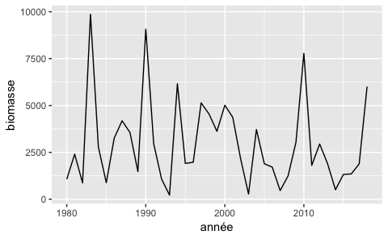
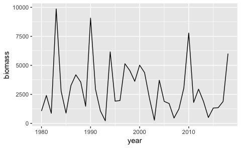
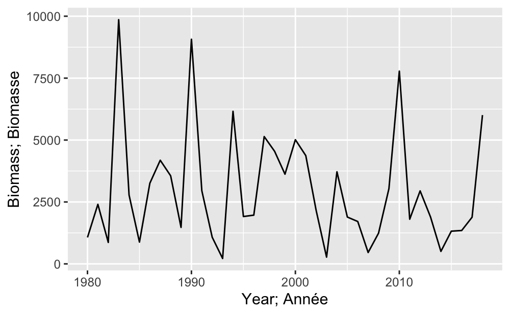

<!-- README.md is generated from README.Rmd. Please edit that file -->

# rosettafish

[](https://travis-ci.org/pbs-assess/rosettafish)
[](https://codecov.io/github/pbs-assess/rosettafish?branch=master)

rosettafish is an R package to translate fish- and fisheries-related
words or short phrases between languages (English to French or French to
English).

This would apply to figure labels to produce separate figures in two
languages, or a single figure with labels in two languages. It can also
be used for other text (such as table headings), but is not intended for
translation of complete sentences.

In particular, it should be useful for automatically producing
translated technical figures to go into Research Documents and
presentations. This is done when building the figures (in R) and saves
someone having to manually edit the figure (in, say, Photoshop). This
preserves the quality and the output formats of figures in both
languages, and is especially time-saving when the same figure axes are
used for multiple figures (e.g., a time series of biomass estimates for
multiple model runs of a stock assessment).

The package has a built-in .csv file of English-French translations of
common technical fisheries terms (that are often incorrectly translated
by generic automatic translators). Users can add to this or use their
own file, and are encouraged to add to the ever-expanding list of common
terms using the instructions below.

## Installation

You can install rosettafish with:

``` r
# install.packages("devtools")
devtools::install_github("pbs-assess/rosettafish")
```

## Examples

``` r
library(rosettafish)
library(ggplot2)
```

``` r
set.seed(1)
years <- seq(1980, 2018)
df <- data.frame(years, biomass = 2000 * rlnorm(length(years), 0, 1))
```

``` r
make_plot <- function(french = FALSE) {
  ggplot(df, aes(years, biomass)) + geom_line() +
    xlab(en2fr("Year", french)) +
    ylab(en2fr("Biomass", french))
}
```

``` r
make_plot()
```


``` r
make_plot(french = TRUE)
```



``` r
english <- TRUE
ggplot(df, aes(years, biomass)) + geom_line() +
  xlab(fr2en("Année", english)) +
  ylab(fr2en("Biomasse", english))
```



``` r
ggplot(df, aes(years, biomass)) + geom_line() +
  xlab(trans("Year", from = "english", to = c("english", "french"))) +
  ylab(trans("Biomass", from = "english", to = c("english", "french")))
```



## Updating the list of translated scientific terms

*If you’re comfortable with Git and file encodings:*

1.  Fork and clone this repository.
2.  Add the terms to the end of the file `data-raw/terms.csv` with a
    text editor (**not Excel\!**). Ensure your editor is saving in UTF-8
    format or the French accents will be destroyed. [Help with UTF-8
    file encoding and
    RStudio](https://support.rstudio.com/hc/en-us/articles/200532197-Character-Encoding).
3.  Source the file data/make-dictionary.R to include data in the
    package (see the more detailed instructions in the next section).
4.  Push to GitHub and submit a pull request.

*If you’d rather a quick way to edit without worrying about Git or file
encodings*:

1.  [Edit the file directly on
    GitHub](https://github.com/pbs-assess/rosettafish/edit/master/data-raw/terms.csv).
2.  Add the terms to the end of the file.
3.  Click the button to create a pull request.

If both of those options are confusing, just [create an
Issue](https://github.com/pbs-assess/rosettafish/issues/new) on the
GitHub site and give us your new translated terms.

## Updating the list and reloading the package to use your terms

The above instructions are fine if you’re willing to wait for us to
merge your pull request. If instead you want to update the terms and use
the package immediately, follow the above instructions to add your terms
and then open `data-raw/make-dictionary.R` and source it in R. This
will:

  - sort the `data-raw/terms.csv` dictionary file alphabetically
  - stop you if there are any duplicates (fix them\!)
  - save the data into the package data so it can be used

After sourcing this file, you can reinstall the package to use it. For
example, with your working directory set to the rosettafish folder:

``` r
devtools::install(quick = TRUE, dependencies = FALSE)
```

Or open the project in RStudio and run Build \> Install and Restart.

You will need to restart any other R sessions to be able to use the
newly installed package.

## Code of conduct

Please note that the ‘rosettafish’ project is released with a
[Contributor Code of Conduct](.github/CODE_OF_CONDUCT.md). By
contributing to this project, you agree to abide by its terms.
